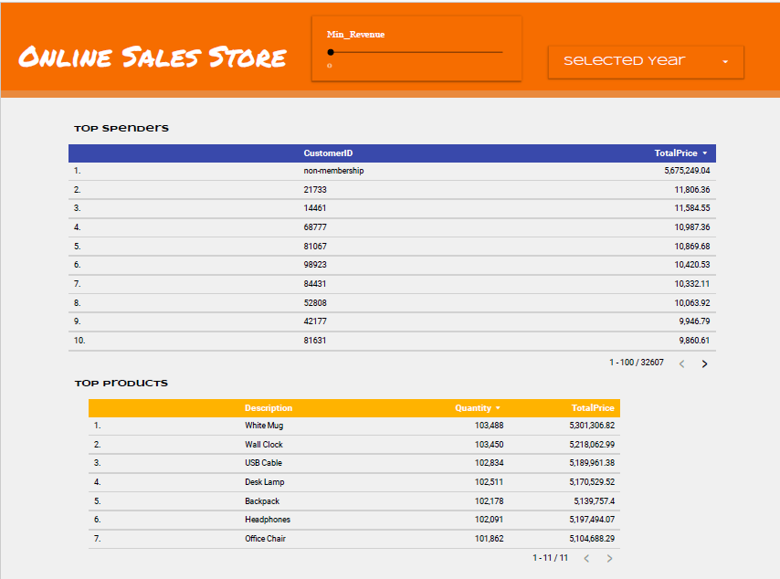

# Online sales data cleansing

**Description**

Online store has a dataset about transaction. This project will do about data profiling, EDA, data cleansing and data visualization. To analyze and do a campaign, such as top spender, top product, top country etc.

**Technologies**

* Data Cleansing with Spark and Pandas

* Do dashboard by Looker Studio

**Data Cleansing with Spark&Pandas**

    Data Profiling

    Exploratory Data Analysis (EDA)

    Data Cleansing : Null value, Data type, Semantic anomalies

Dashboard Result 

Dashboard Link : https://lookerstudio.google.com/reporting/3456ae0e-248f-4c92-a2e7-477bed8d4b21

Dataset : https://www.kaggle.com/datasets/yusufdelikkaya/online-sales-dataset